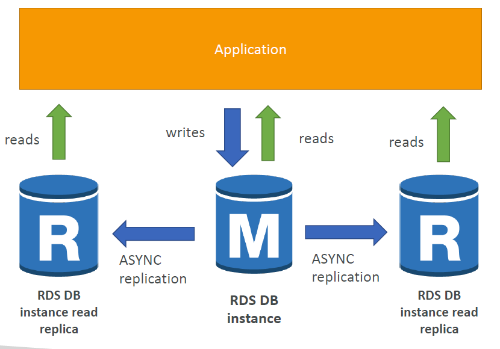
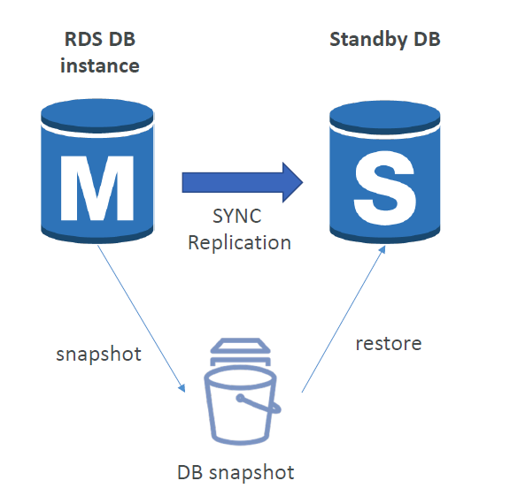

# 🗄️ Amazon Relational Database Service (RDS)

---

## 🏗️ RDS vs. EC2 Database Deployments

Choosing RDS over manually configuring a database engine on an EC2 instance shifts operational maintenance to AWS:

* **Automated Management:** Provisioning, OS patching, software updates, and scaling are handled automatically.
* **Continuous Backups:** Automated daily snapshots with **Point-in-Time Restore (PITR)** capabilities down to the second.
* **Storage Foundation:** Built entirely on top of high-performance Amazon EBS volumes.
* **Storage Auto-Scaling:** Automatically detects when free storage falls below 10% and scales up disk capacity without downtime.
* 🚨 **The Hard Constraint:** You **cannot SSH** into an RDS instance. You have no root operating system administration access.

---

## 🔄 RDS Read Replicas (Scaling Reads)

* **Purpose:** Designed exclusively to scale **Read Performance** and offload heavy read queries from the primary database instance.
* **Mechanism:** Handles up to **15 Read Replicas** per primary instance.
* **Replication Type:** **ASYNCHRONOUS Replication.** This means there can be a slight "replication lag" between the primary writing data and the replica showing it.
* **Promotion:** Any Read Replica can be manually promoted to become its own standalone independent primary database if needed.

### 💰 Read Replica Cost Architecture
* **Same Availability Zone:** Data transfer is entirely **Free**.
* **Cross Availability Zone:** Data transfer incurs network egress **Charges** ($).

---

## 🛡️ RDS Multi-AZ Deployment (High Availability & DR)

* **Purpose:** Designed strictly for **Disaster Recovery (DR)** and High Availability. It does not scale performance.
* **Mechanism:** AWS automatically provisions a hidden **Standby Instance** in a completely separate Availability Zone.
* **Replication Type:** **SYNCHRONOUS Replication.** Every write to the primary must successfully write to the standby before the transaction completes. This guarantees zero data loss.
* **Automated Failover:** If the Primary AZ loses power or crashes, the DNS endpoint automatically flips to the Standby instance within minutes without requiring application code changes.
* **Modifying State:** You can seamlessly convert an online database from Single-AZ to Multi-AZ with zero downtime; AWS will automatically snapshot the primary, restore it in a secondary AZ, and establish synchronous replication sync loops.

---

## 🎛️ RDS Custom (The OS Exception)

* **What is it?** A hybrid managed service designed specifically for **Oracle** and **Microsoft SQL Server** database systems.
* **RDS vs. RDS Custom Access Control Matrix:**
    * **Standard RDS:** AWS completely manages the underlying host OS. Full administrative access is restricted.
    * **RDS Custom:** Grants you **full root administration privileges and underlying OS access** (via SSH/SSM). This allows you to install custom third-party database plugins, patch internal DB binaries, or alter underlying file system configurations, while still taking advantage of AWS managed backups.