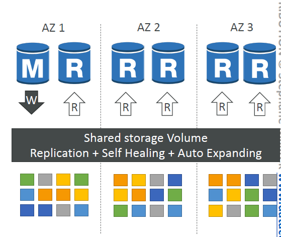
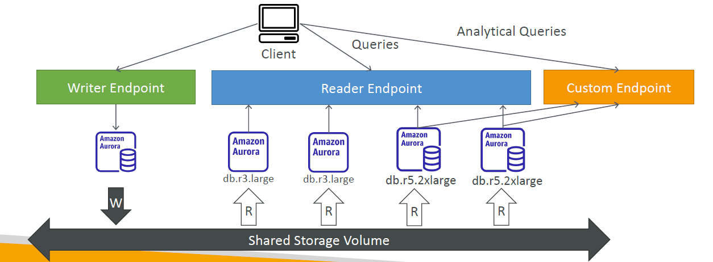
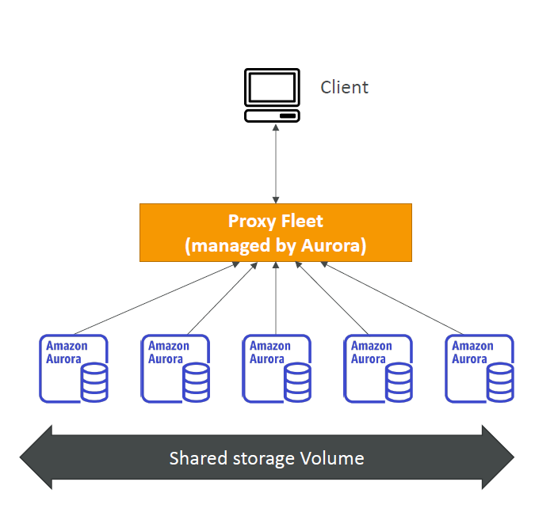

# 🌅 Amazon Aurora & Database Security (SAA-C03)

## 🏗️ Aurora High Availability & Read Scaling

### Quorum-Based Storage Architecture
Aurora does not use traditional replication for its primary storage layer. Instead, it relies on a shared, virtual storage volume distributed across multiple data centers.
* **6-Way Replication:** Aurora automatically maintains **6 copies of your data distributed across 3 Availability Zones (AZs)**.
* **Storage Striping:** Storage is broken down into 10GB blocks and striped across hundreds of storage volumes.
* **Self-Healing:** The storage layer uses peer-to-peer replication to automatically detect and repair degraded or corrupted blocks without affecting performance.
* 📊 **The Quorum Rules (Highly Tested):**
    * **Write Quorum:** Requires **4 out of 6 copies** to acknowledge a write before it is committed. The cluster can survive the loss of an entire AZ plus one additional node without losing write capabilities.
    * **Read Quorum:** Requires **3 out of 6 copies** to acknowledge a read. The cluster can survive the loss of 3 storage nodes without losing read capabilities.

### Compute Nodes & Failover
* **Primary Instance:** Exactly one instance handles all read/write operations (the Master).
* **Read Replicas:** Connects up to **15 Aurora Read Replicas** to serve read-heavy traffic.
* **Instant Failover:** If the primary instance fails, automated failover promotes a Read Replica to Master in **under 30 seconds**.

---

## 📦 Aurora DB Cluster Topologies

### 🔌 Aurora Custom Endpoints
Instead of forcing your application to connect directly to individual database instances, Aurora exposes unified network endpoints:
* **Cluster Endpoint (Writer):** Always points to the current Primary instance. Used for all write transactions.
* **Reader Endpoint:** Load-balances incoming connections across all available Read Replicas at the DNS layer.
* **Custom Endpoints:** Allows you to group specific database instances together for specialized workloads.
    * *Example:* Grouping high-capacity instances into an analytical endpoint for data science queries, while leaving standard instances to handle general web traffic.

---

## ⚡ Specialized Aurora Deployments

### Aurora Serverless
* Automatically starts up, shuts down, and scales database compute capacity (up or down) based on actual application utilization.
* Capacity is measured in **ACUs (Aurora Capacity Units)**.
* **Best Use Case:** Highly unpredictable, variable, or intermittent workloads (e.g., test environments, infrequent cron jobs) to avoid paying for idle compute instances.

### Aurora Global Database (Cross-Region Scaling)
Designed for cross-region disaster recovery and ultra-low latency international operations.

* **Architecture:** 1 Primary Region handles Read/Write workloads. Up to **10 Secondary (Read-Only) Regions** can be attached.
* **Regional Scaling:** Each secondary region can host up to 16 native Read Replicas to serve local users.
* **Performance:** Uses direct, dedicated storage-level cross-region replication. Replication lag is typically **under 1 second**.
* **Disaster Recovery:** If the primary region undergoes a complete outage, promoting a secondary region to full Read/Write capability features an **RTO (Recovery Time Objective) of < 1 minute**.

---

## 🤖 Aurora Machine Learning
Allows application developers to run ML predictions directly inside SQL queries using standard relational data, without writing custom application layer integration code.

* Integrates natively with **Amazon SageMaker** (for any custom ML models) and **Amazon Comprehend** (for automated sentiment analysis).

---

## 💾 Backup, Restore, & Cloning Operations

### Backup Mechanisms
* **Amazon RDS Backups:** Automated backups retain data for 1 to 35 days. Setting retention to `0` completely disables automated backups. Supports manual DB snapshots.
* **Amazon Aurora Backups:** Automated backups retain data for 1 to 35 days and **cannot be disabled**. Supports manual DB snapshots with zero performance impact.

### Database Recovery & S3 Migration
> ⚠️ **Exam Core Concept:** Restoring any database snapshot or point-in-time backup **always creates an entirely new database instance** with a completely unique DNS endpoint string.

* **Migrating On-Premises MySQL to RDS via S3:**
    1. Create a native backup of your local database.
    2. Upload the raw backup file into an **Amazon S3** bucket.
    3. Restore that backup file directly into a brand-new Amazon RDS MySQL instance.
* **Migrating On-Premises MySQL to Aurora via S3:**
    1. Create a local backup using **Percona XtraBackup**.
    2. Stream or upload the backup files into an **Amazon S3** bucket.
    3. Use the Aurora console to restore the S3 files into a brand-new Aurora MySQL DB cluster.

### 👥 Aurora Database Cloning
* Instantly creates a new, independent copy of an existing Aurora cluster.
* **How it works (Copy-on-Write):** The clone shares the exact same physical storage blocks as the parent cluster initially, making creation nearly instantaneous and highly cost-effective. Storage costs are only incurred when data is modified or added on either the parent or the cloned cluster.
* Faster and significantly more efficient than running a traditional snapshot-and-restore sequence.

---

## 🔒 Relational Database Security Architecture (RDS & Aurora)

| Security Domain | Control Mechanism | Operational Rules |
| :--- | :--- | :--- |
| **Encryption at Rest** | AWS KMS (Key Management Service) | Must be configured explicitly at cluster creation time. **If the master is unencrypted, replicas cannot be encrypted.** To encrypt an unencrypted DB, take a snapshot, copy it as encrypted, and restore it. |
| **Encryption in Flight** | TLS / SSL | Enabled by default across all connections. Requires client-side AWS TLS root certificates to verify connection integrity. |
| **Authentication** | IAM Database Authentication | Allows secure connection to database engines using IAM user/role tokens instead of traditional, static hardcoded usernames and passwords. Token lifespan is limited to 15 minutes. |
| **Network Security** | Security Groups | The primary method to lock down access. Network ingress rules should restrict inbound port access (e.g., TCP 3306 or 5432) exclusively to the security groups of your application servers or load balancers. |
| **Host Access** | Operating System Lockdown | Traditional shell access via SSH is completely disabled across standard RDS and Aurora engines. **Exception:** Only available when executing on **RDS Custom** deployment models. |
| **Compliance & Auditing** | CloudWatch Logs | Advanced database audit logs can be streamed directly to CloudWatch Logs with long-term retention and anomaly detection alerts. |