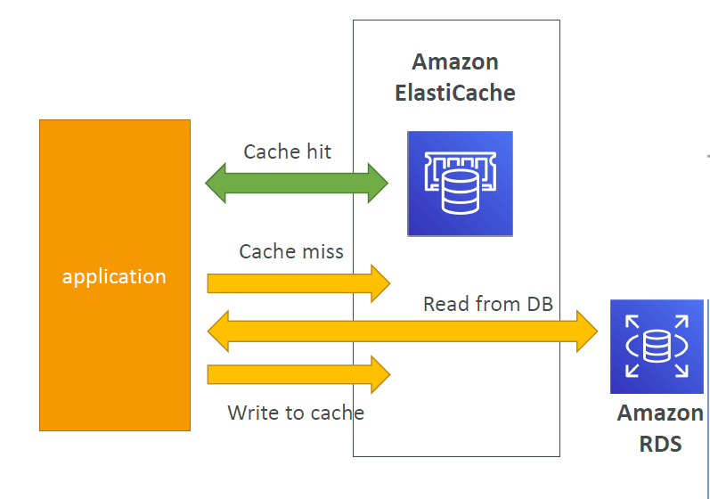
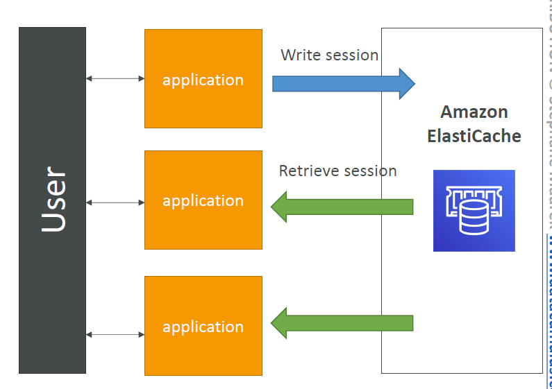

# ⚡ Amazon ElastiCache (SAA-C03)

### 💡 TL;DR: The Caching Paradigm
> **Architectural Mindset:** Amazon ElastiCache is a fully managed, in-memory data store used to deploy sub-millisecond latency caching layers. In exam scenarios, look for patterns where a relational database (like RDS) is choking on read heavy-workloads or your application tier needs a centralized, highly available cluster to manage stateless web sessions.

---

## 🏗️ ElastiCache Solution Architectures

### 1. Database Caching (Cache-Aside Pattern)
* **Mechanics:** The application layer intercepts data requests by checking ElastiCache first.
    * **Cache Hit:** Data exists in memory; it is returned instantly to the client.
    * **Cache Miss:** Data is absent from memory. The application queries the backend relational database (RDS), serves the client, and writes that query result back into ElastiCache so subsequent requests hit the cache.
* **Data Consistency:** Cache architectures must implement strict TTL (Time to Live) parameters or explicit invalidation strategies to prevent applications from consuming stale data.

### 2. Distributed User Session Store
* **Mechanics:** Enables application servers to become entirely stateless. 
* When a user logs into any specific instance within an Auto Scaling Group, the application writes their active session state, shopping cart, or login tokens directly into an ElastiCache cluster.
* If a subsequent request is routed to an entirely different EC2 instance, that server fetches the session data cleanly from ElastiCache, preserving user state seamlessly.

---

## 🔄 Redis vs. Memcached (The Architectural Choice)

AWS will test whether you can select the correct caching engine based on application requirements.

| Architectural Feature | 🔴 Amazon ElastiCache for Redis | 🔹 Amazon ElastiCache for Memcached |
| :--- | :--- | :--- |
| **High Availability** | **Yes** (Supports Multi-AZ deployment with automated failover) | **No** (If a node dies, the data cached on that node is lost) |
| **Scaling Reads** | **Yes** (Supports up to 5 read replicas per shard) | **No** (Scales out strictly via horizontal sharding) |
| **Data Persistence** | **Yes** (Supports AOF logging and snapshot backup/restore) | **No** (Volatile, purely ephemeral in-memory storage) |
| **Architecture Type** | Single-threaded engine | **Multi-threaded** (Can utilize multiple CPU cores) |
| **Data Structures** | Complex types (Lists, Sets, Sorted Sets, Hashes, Geospatial) | Simple Key-Value pairs only |
| **Sharding Layout** | Redis Cluster mode (horizontal partition mapping) | Pure Multi-node horizontal data partitioning |

---

## 🔒 ElastiCache Security Architecture

### Authentication Frameworks
* **ElastiCache for Redis:**
    * **IAM Authentication:** Leverages AWS IAM roles to authorize users connecting to the cluster.
    * **Redis AUTH:** Allows you to configure a secure, static password string/token directly on the cluster creation loop. This adds an isolated authentication wall on top of your standard network rules.
* **ElastiCache for Memcached:**
    * Supports advanced **SASL-based** token authentication models.

### Network & In-Flight Security
* **Security Groups:** Used to restrict inbound connection access strictly to the security group wrappers of your application compute nodes or load balancers.
* **In-Flight Encryption:** Built-in Transport Layer Security (TLS/SSL) encryption support protects moving data packets from intersection or sniffing attacks.