# 🌍 DNS & Amazon Route 53 (SAA-C03)

> **Mental Model:** Computers talk in numbers (IP addresses like `18.19.10.11`). Humans talk in words (like `example.com`). DNS (Domain Name System) is simply the translator between the two. **Route 53** is AWS's highly available, fully managed DNS service. *(Fun fact: Why is it called 53? Because DNS traffic traditionally travels over TCP/UDP Port 53!)*

---

## 📖 Basic DNS Terminology
Before touching AWS, you need to know the basic web terms:
* **Domain Registrar:** The company you pay to register your name (e.g., GoDaddy, Namecheap, or AWS Route 53).
* **DNS Records:** The actual translation rules (A, AAAA, CNAME, etc.).
* **Top Level Domain (TLD):** The very end of the URL (`.com`, `.org`, `.gov`).
* **Second Level Domain (SLD):** The main name you buy (`amazon.com`, `google.com`).

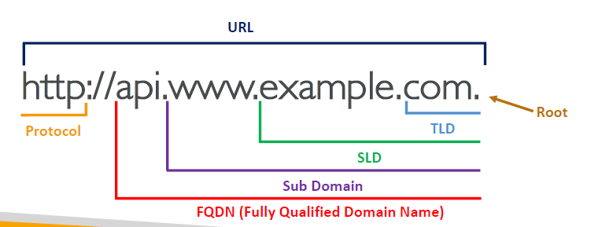

### How DNS Works Under the Hood
*(When you type a URL, your browser bounces between several servers to find the final IP).*
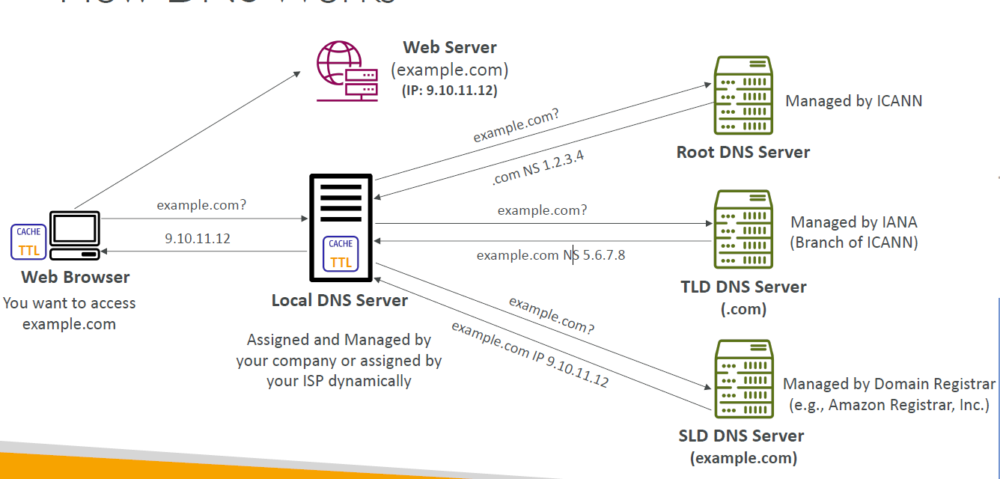

---

## 🗺️ Amazon Route 53 Overview
Route 53 is an **Authoritative** DNS. That simply means *you* (the customer) have full control to update and manage the DNS records yourself. 

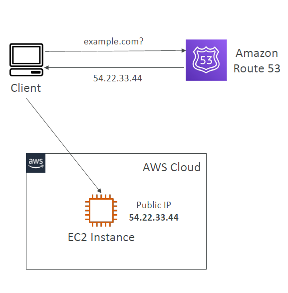

### 📂 Hosted Zones
Think of a Hosted Zone as a folder/container that holds all the routing records for your specific domain. You pay $0.50 per month per hosted zone.
1. **Public Hosted Zone:** For traffic coming from the public internet (e.g., anyone typing your website).
2. **Private Hosted Zone:** For traffic strictly internal to your AWS VPC (e.g., your backend EC2 instances talking to an internal database).

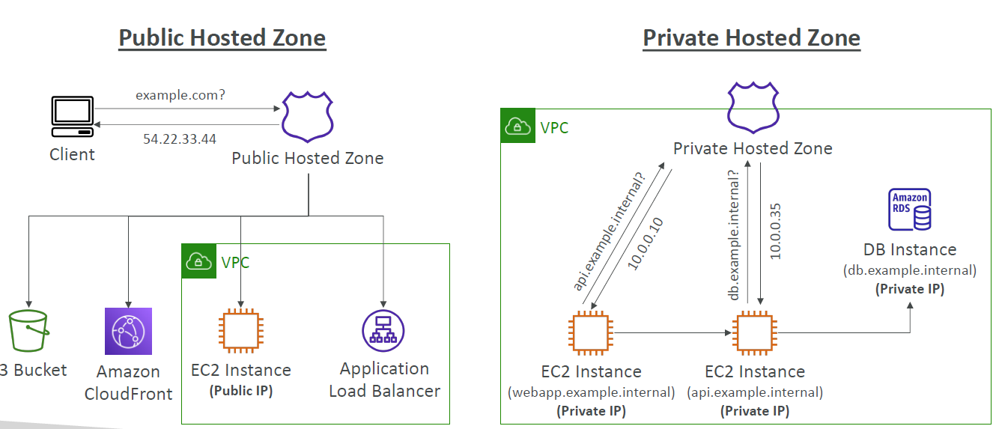

---

## 📝 Route 53 Record Types (The Rules)

Every DNS record contains a Domain, a Record Type, a Value (the IP), a Routing Policy, and a TTL.

### The 4 Records You MUST Know:
* **A Record:** Maps a hostname to an **IPv4** address. *(A = Address)*
* **AAAA Record:** Maps a hostname to an **IPv6** address. *(AAAA = Address x 4)*
* **CNAME:** Maps a hostname to *another* hostname (e.g., `app.domain.com` points to `target.domain.com`). 
    * 🚨 *Limitation:* You **cannot** use a CNAME for your root/Zone Apex domain (you can't use it for `example.com`, only `www.example.com`).
* **NS (Name Server):** Controls which servers actually manage the routing for your domain.

---

### ⏱️ TTL (Time To Live)
TTL dictates how long user devices (like your laptop or ISP) cache the DNS result before asking Route 53 for the IP again.
* **High TTL (e.g., 24 hours):** Cheaper (fewer requests to Route 53), but if you change your server's IP, it will take 24 hours for all your users to see the change.
* **Low TTL (e.g., 60 seconds):** More expensive (more queries), but highly responsive. If your server crashes, you can update the IP and users will be rerouted in 1 minute.

---

### 🥊 The Ultimate Exam Trap: CNAME vs. Alias
AWS will test this on every single exam. When pointing your domain to an AWS resource (like an ALB or CloudFront), which do you use?

| Feature | CNAME | Alias (AWS Specific) |
| :--- | :--- | :--- |
| **Target** | Points to any standard hostname. | Points specifically to an **AWS Resource** (like an ALB). |
| **Root Domain (`example.com`)** | ❌ Cannot be used on the root domain. | ✅ **Works on the root domain (Zone Apex).** |
| **Cost** | Standard query pricing. | 💸 **100% Free of charge.** |
| **Health Checks** | No native health checks. | Has native AWS health checks. |

> **Exam Rule:** If the question asks how to map a root domain (`example.com`) to an Application Load Balancer, the answer is **ALWAYS an Alias Record**.

---

## 🔀 Route 53 Routing Policies

Don't let the word "Routing" confuse you—Route 53 does *not* balance network load like an ALB. It just answers the DNS query with a specific IP address based on the rules you set below.

### 1. Simple Routing Policy
* **Mental Model:** "The Bouncer." It just lets everyone in. 
* You route traffic to a single resource. If you assign multiple IPs to it, the client just picks one randomly. 
* ❌ *Cannot* be associated with health checks.
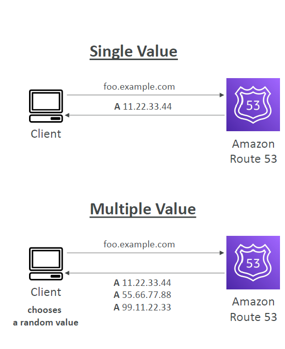

### 2. Weighted Routing Policy
* **Mental Model:** "The A/B Tester."
* You control the exact percentage of traffic going to different resources. Great for testing a new application version (e.g., send 80% to v1, and 20% to v2).
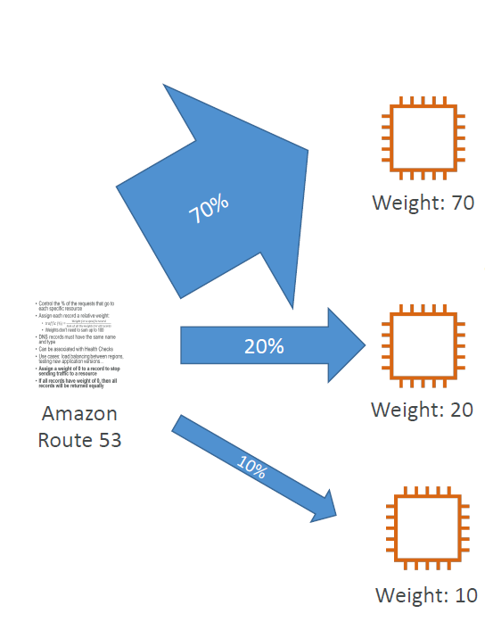

### 3. Latency-Based Routing Policy
* **Mental Model:** "The Speed Demon."
* Evaluates the network latency between the user and AWS Regions, and redirects the user to the region that will load the fastest for them.
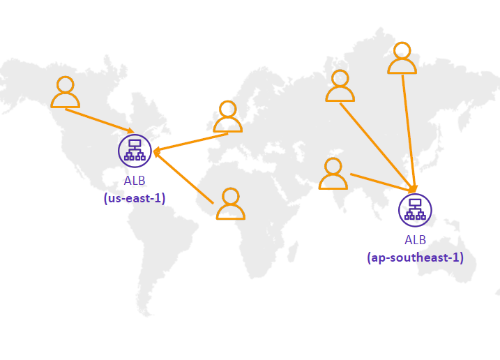

### 4. Geolocation Routing Policy
* **Mental Model:** "The Passport Check."
* Routing is based purely on the physical location of the user (e.g., "If user is in France, send to the Paris region"). 
* 🚨 *Exam Trap:* You **must** create a "Default" fallback record in case AWS can't figure out where the user is located.
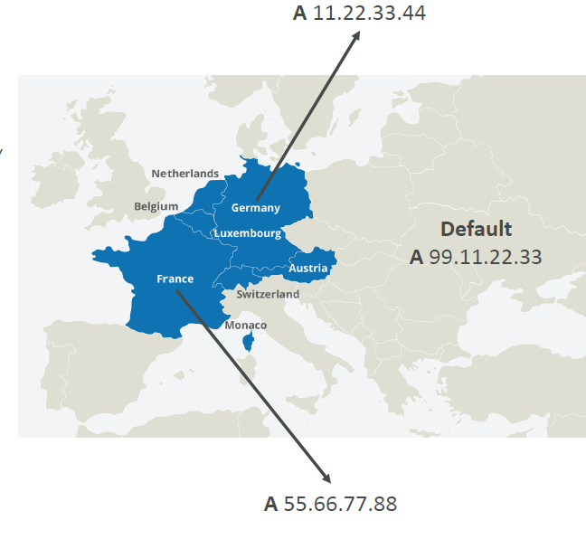

### 5. Geoproximity Routing Policy
* **Mental Model:** "The Boundary Shifter."
* Routes traffic based on the geographic location of users *and* your resources. 
* **Key Feature:** You can use a **"Bias"** value to artificially expand or shrink the geographic region a specific server covers.
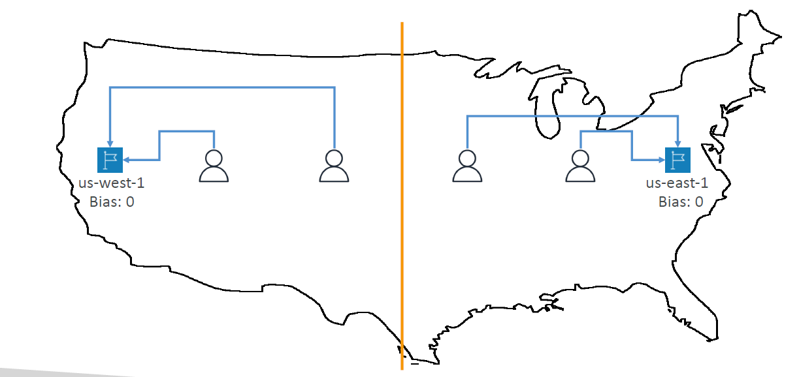
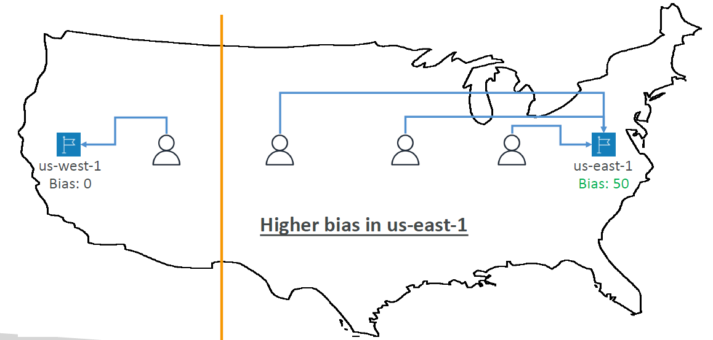

### 6. IP-Based Routing Policy
* **Mental Model:** "The VIP List."
* You provide a list of CIDR blocks (IP ranges) belonging to your clients or specific ISPs. Route 53 checks the incoming IP against your list and routes them accordingly. 
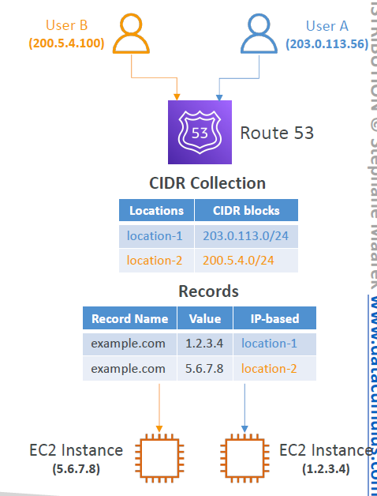

### 7. Failover Routing Policy (Not pictured)
* **Mental Model:** "The Backup Generator."
* You set up a Primary and a Secondary instance. Route 53 actively monitors the Primary with a Health Check. If the Primary dies, it automatically flips all DNS traffic to the Secondary.

# for classic solution architect plz follow PPT
