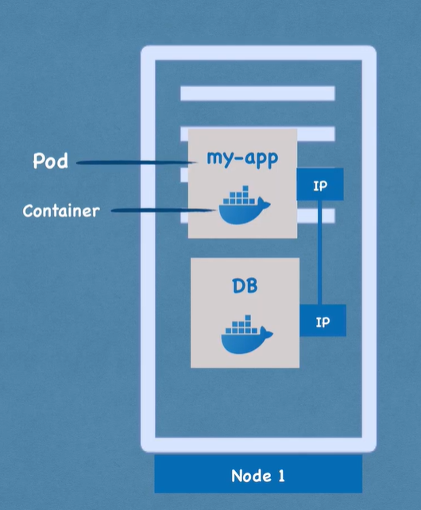
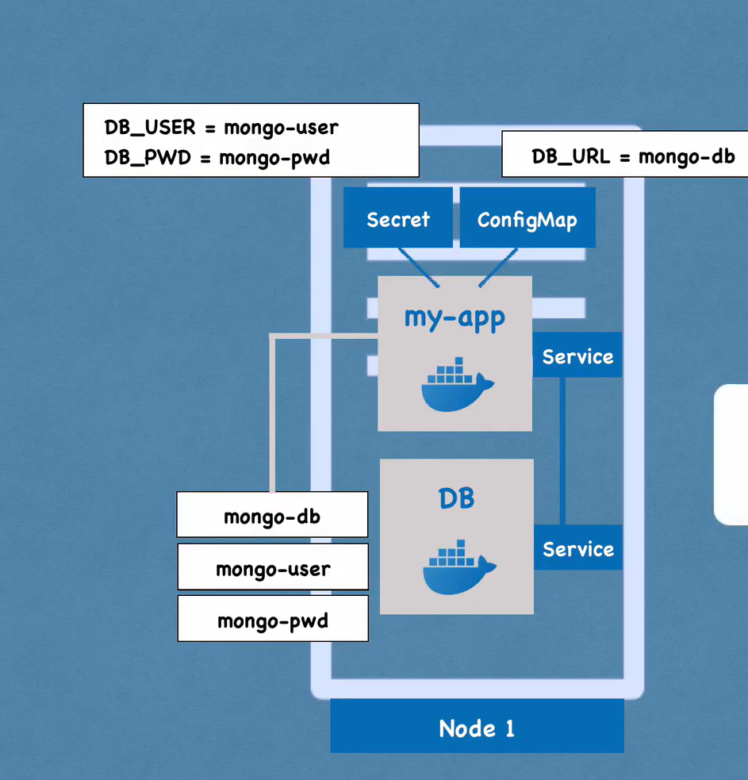

# Kubenetes
- use for managing containers 
  - 100s of envirement 
  - manage in diifrent envirement 
- this is Orchitration tool
- main Component 
  - node
  - pod
  - svc
  - secreat
  - deploy
  - sts
  - ing

## Feture provide or problem solve 
1. Hight Availibility 
2. Scalability 
3. Distaer recovery 

# POD 
1. smallest component of K8s 
2. Abstraction over container 
3. Usually 1 apllication per pod 

- So how this pod to each other ?
  - fro that we have internal Commuincation system in K8s.\
  - we have Each Pod there IP (Not Container) 
  - using that internal IP thay communicate 
  - but whenver POD dies due to someapplication error or somting wher new Component come into Picturename AS "Services"

# Service 
- is is like satic IP For POD 
## External service vs internal sevice 
- if you node havse two pod one is app and other is database so you want app to acess in browser so that pod service we do as external servic
- and other side the data base we dont want to acess outside so we will make it as inyternal service 

# iNGRESS
- we dont want to be our URl look like 1993.93.83.:8080 we want domain name my-app.com for that Ingress come in picture 

# Configmap
- we have app and databse two pod if any case the url or paswwor or anything chnage in DB pod we need to chnage image of my app lest say we cange name of db Conatiner MongDB-user to Mongo_user then we meed to do that chnage in My-app image -> need to build -> store and restart it .
- it is long process , so for that configmap come in to picture 
- so that type of data we store in Configmap so we only do chage in that and read from that 

# Secrets  
- its similer to configmap just to use to store secreat data like pasword and all .
- its encodedd-16
- 

# Volumes
- it is used to persistance data,its similer / it is Docker Volumes
-  it can be local or ccloude 

## Why we need multiple replicas of pod ?
- whnever any node dies while  restart they need some time - that is downtime so we dont want that thats why we need replicas so one dies other are live Thrtough Service  (Static IP )
- Service has 2 usecase :
  - Permant IP
  - Load balancer 

# deployment
- we dont work with Pods we only work with deployment there we manage all data .
# Statefulset 
- as we make replicas of pod similerly we need replicass of datbase but database has there state i.e. DATA 
- so here Statefulset com in picture - Statefulset is usefil for Stateful apps
- Note -  
  - it is very dificult to deploy with STATEFULSET compare to DEPLOYMENT so most  time we host database outside the K8s and deploy sateless app Using Deployment 
