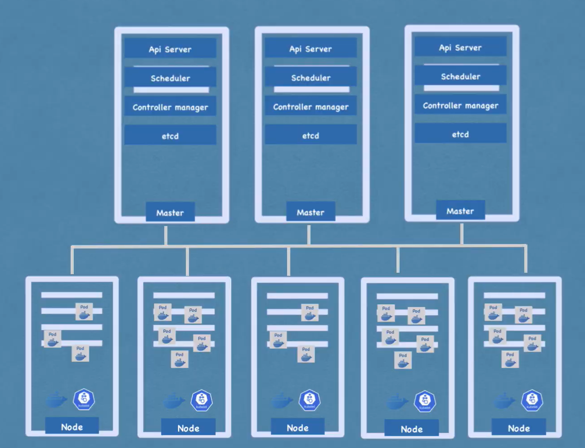

# Kubernetes Architecture 

## Node server (Workerd server)
-  Worker Nodes are actual nodes that run process 
-  there we need main three services to install 
    1. kubelet
    2. Kube proxy 
    3. Conatiner Runtime
   
### Conatiner Runtime 
- e.g Docker, Continerd , cri-o.

### Kubelet 
- kubelet interact with Both - the conatiner and node 
- kubelet is actuall handle nodes inside pods like giving resouces , Container runtime etc.

### KUbe Proxy 
- its handle the communication b/w nodes 

## Master Node 
- so now how we can handel shedule pod, monitor ,  reshedule , restart or join a new node hee master node come in picturure .
- all managing done BY Master node.
- 4 Process Run on Master node :- 

###  API server 
- act as a gate , every request  to cluster came from outside is came throgh through API Server.
- its also authinticate the equest only help to get valid request.

### Scheduler 
-  it is help to shedule the  pod , where , how, in architecture 
-  so it has intelligance to which worker node we should shedule the new  pod , so whichtever has low load and avilable resources for nod there shedulaer add the node 
-  sheduler only decide which node actual addind node is DOne by Kubelet - as we see inprevious lesson
  
###  Controller manager 
- so how we can dind any node is dead or some error. for that we have 'Controller manager'. 
- Controler manager manage the state  of node. and if any problem then request Shedular to shedule new node.

### etcd 
- key value pair 
- it is a ccluster brain 
- it is store all the inforamtionwhat happening in etcd 
- NOTE : it dont store the application data.