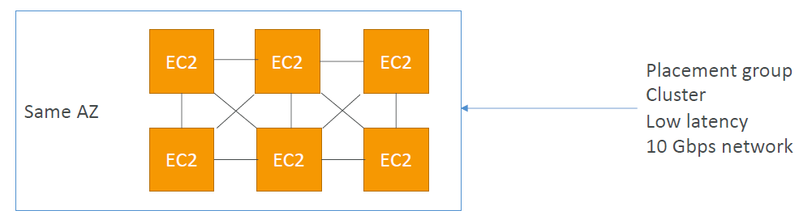
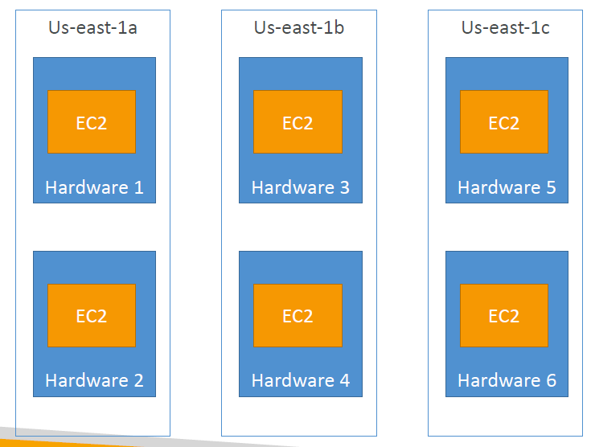
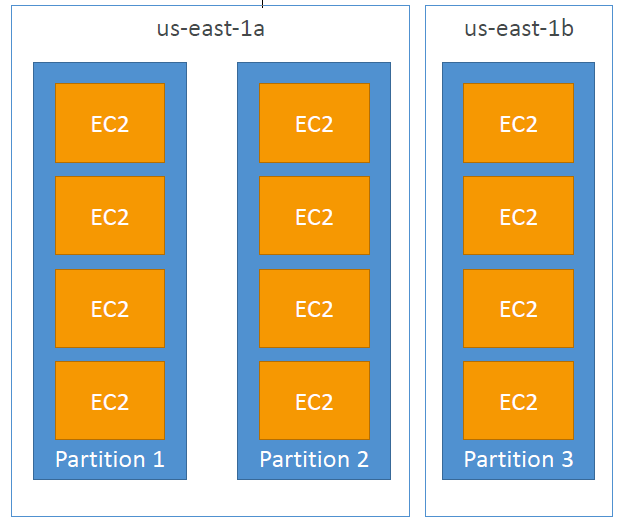
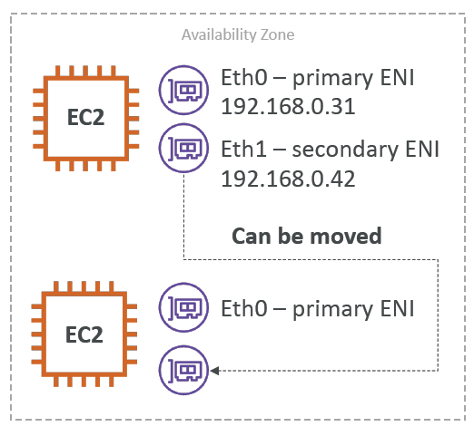

# Private vs Punlic vs Elastic IP

## 🌐 IP Addressing: Private, Public, & Elastic

### IPv4 vs. IPv6
*   **IPv4:** Most common format (e.g., `1.160.10.240`).
*   **IPv6:** Used for scaling (especially IoT devices) (e.g., `3ffe:1900:4545:3:200:f8ff:fe21:67cf`).

### Public vs. Private IPs
| IP Type | Scope | Accessibility |
| :--- | :--- | :--- |
| **Public IP** | Internet | Unique across the entire web. Accessible from the outside world. |
| **Private IP** | Internal Network | Unique only within your specific VPC. Used for backend services (like Databases) to keep them secure. |

### Elastic IPs (EIP)
*   **The Problem:** When you stop and start an EC2 instance, its standard Public IP changes.
*   **The Solution:** An Elastic IP is a fixed (static) Public IPv4 address that you own until you delete it.
*   **Limits:** You are limited to **5 Elastic IPs** per AWS account.
*   🚨 **Exam Trap / Best Practice:** AWS strongly recommends **avoiding Elastic IPs** for production apps.
    *   *Alternative 1:* Use a random Public IP and map a Route 53 DNS name to it.
    *   *Alternative 2:* Use an Application Load Balancer (ALB) to handle the static entry point.

---

## 🏗️ EC2 Placement Groups
You want control over the physical hardware placement of your EC2 instances.

| Placement Group | Architecture | Pros / Cons | Exam Use Case |
| :--- | :--- | :--- | :--- |
| **Cluster** | Instances are packed tight together on the same rack. | **Pros:** 10 Gbps network speed.   **Cons:** Single point of failure (if the rack dies, everything dies). | Big Data, Hadoop, ultra-low latency jobs. |
| **Spread** | Instances are strictly separated across different hardware/racks. | **Pros:** Max High Availability.   **Cons:** Limited to 7 instances per AZ. | Critical apps where failure of one instance cannot impact another. |
| **Partition** | Instances are spread across logical "partitions" (racks) but you can have many instances per partition. | **Pros:** Can scale to 100s of instances.   **Cons:** Partitions don't share racks. | Distributed apps like Kafka, Cassandra, HBase. |

## Cluster
-  
-  
## Spread

## Partition 

---

## 🔌 Elastic Network Interfaces (ENI)
*   **What is it?** A logical, virtual network card for your EC2 instance.
*   **Attributes of an ENI:**
    *   1 Primary IPv4 address (and multiple secondary IPs)
    *   1 Elastic IP
    *   1 Public IPv4 address
    *   1 MAC Address
    *   1 or more Security Groups attached
*   🚨 **Exam Trap (Failover Routing):** ENIs can be detached from one instance and attached to a backup instance on the fly. If an EC2 fails, you can move its ENI to a standby EC2 instance, and the network traffic will instantly reroute to the new machine!
*   *Limitation:* ENIs are bound to a specific Availability Zone (AZ).

- 

## 💤 EC2 Hibernate
*   **The Problem:** Normally, when you stop an EC2 instance, data on the EBS volume is saved, but the **RAM (memory)** is wiped. When you restart, the OS has to boot up completely from scratch.
*   **The Hibernate Solution:**
    1. You trigger Hibernate.
    2. The EC2 instance takes the data currently in the RAM and writes it to the root EBS volume.
    3. The instance stops.
    4. When you start it again, it loads the RAM state from the EBS volume back into memory.
*   **Why use it?** Extremely fast boot times for applications that take a long time to start up or load caches.