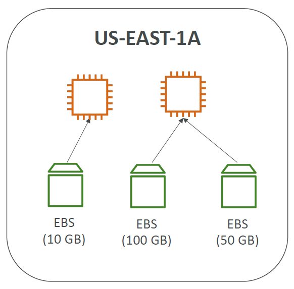
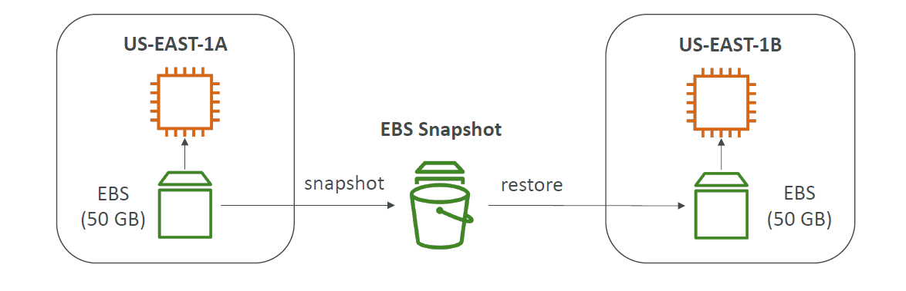
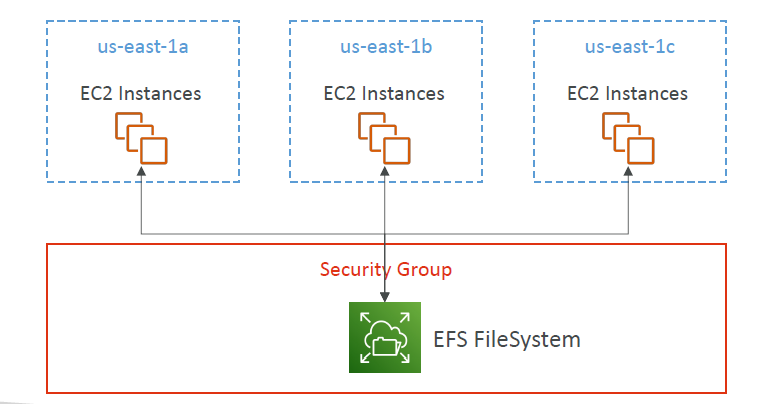

# EBS
- EBS(Elatic Block Store) volume is network drive that you can attach to your instance while they run  
- its allow instance to persist data even after  terrmination 
- they mounted only one instance at a time 
-
## more points 
- it is network Drive not Physical drive, it uses network to commumcate the instance , that can some time cause letency 
- it is AZ based so we can only attach from one ec2 to other in same AZ
- if you attach and deattach outside AZ then you need take to snapshot
- 

## Delete  on termination Attribut 
- it is attribute if Enaable then EBS willbe get deleted afterr EC2Instace get terminated
  - by deffault root EBS volume will be deleted because Attribute is Enabled 
  - and if ypu added extra EBS volume that by default attribute is Disabled 

## EBS Snapshot 
- Snapshot is a feture that make Backup of EBS volume 
- or we can move EBS Across AZ using Snapshot 
- 

### Feature 
- **EBS Snapshot Archive**: wee caan move EBS snap to EBS snapshot(Archive tiear) that is 75 % cheper we can recover in 24 to 75 hrs 
- **Recycle BIN** : we can use EBS snapshot as  recycle  bin we can attach rule  delete after pecific time 

## EC2 Instance Store
- EBS volumes are network drives with good but “limited” performance
- If you need a high-performance hardware disk, use EC2 Instance Store
- Better I/O performance
- EC2 Instance Store lose their storage if they’re stopped (ephemeral)
- Good for buffer / cache / scratch data / temporary content
- Risk of data loss if hardware fails
- Backups and Replication are your responsibal

## EBS Volume Types

- **gp2 / gp3 (SSD)**: balances price and performance
- **io1 / io2 Block Express (SSD):** Highest-performance,low-latency or high-throughput workloads
- **st1 (HDD):**  Low cost HDD,frequently accessed, throughput intensive workloads
- **sc1 (HDD):** Lowest cost HDD, less frequently accessed workloads.

##  Encryption 
- Data at rest is encrypted inside the volume
- All the data in flight moving between the instance and the volume is encrypted
- All snapshots are encrypted
- All volumes created from the snapshot

## Amazon EFS – Elastic File System
- Managed NFS (network file system) that can be mounted on many EC2
- EFS works with EC2 instances in multi-AZ
- Highly available, scalable, expensive (3x gp2), pay per use
- 
- *Compatible with Linux based AMI*
- 
