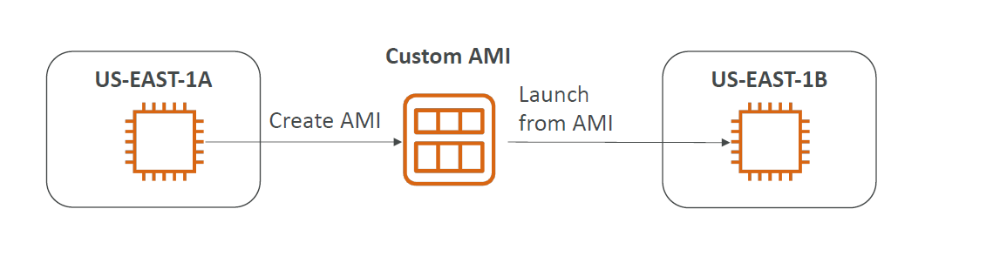

# AMI 
- AMI = Amazon machine Image
- its just like docker image ec2 + whateverr software + pre=package + configration
- you can Launch EC2 from 
  - A Public AMI
  - Your Own AMI
  - AWS Marketplace 
- 
