# 📈 Scalability, High Availability, & Load Balancing (SAA-C03)
---
## 🏗️ Core Architecture Concepts

### Scalability (Handling Growth)
* **Vertical Scaling:** Increasing the size/capacity of a single instance (e.g., upgrading from a `t2.micro` to an `m5.large`). 
    * *Limitation:* Bound by hardware maximums. Requires downtime to change instance types.
* **Horizontal Scaling:** Increasing the *number* of instances running concurrently (e.g., scaling from 2 EC2 instances to 20).
    * *Advantage:* Highly elastic. Easily automated using Auto Scaling Groups.

### High Availability (Surviving Failures)
* Deploying application components across separate geographic infrastructure networks (**Multi-AZ** setups).
    * If an entire Availability Zone goes dark due to a power failure, passive or active standby instances in a secondary AZ immediately absorb the traffic, preventing system downtime.

---

## 🔄 Elastic Load Balancing (ELB)

### Why Use a Load Balancer?
* Distributes application traffic across a fleet of target backend servers (EC2, Containers, IP addresses).
* Exposes a single, unified entry point (**DNS Name**) to the outside world.
* Performs automated **Health Checks** to stop sending traffic to degraded or dead instances.
* Handles **SSL/TLS Termination** (decrypts HTTPS traffic before passing it to backend servers).

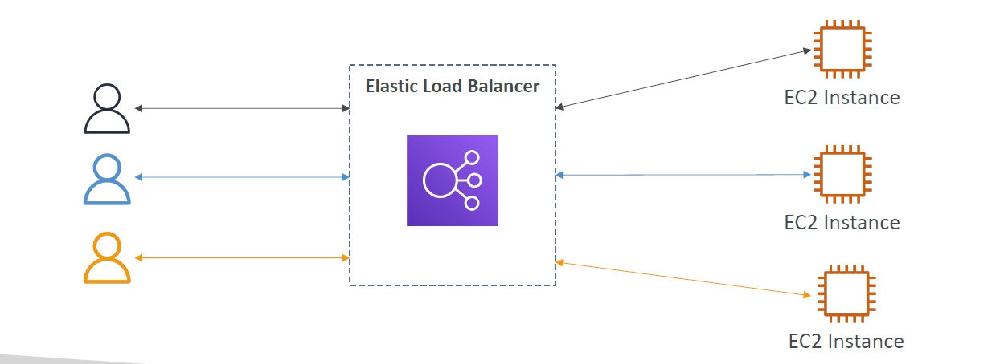

### 🩺 Health Checks
* Crucial mechanism ensuring high availability. The ELB pings a specific protocol, port, and relative path (e.g., `HTTP /health`) at regular intervals.
* If an instance returns anything other than a `200 OK` status across a configured threshold of consecutive checks, it is flagged as **Unhealthy** and temporarily pulled out of the rotation.

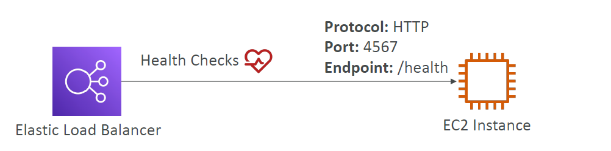

### 🔒 Load Balancer Security
* **Security Groups:** An ELB acts as a security barrier. Users speak directly to the ELB via public ports (`80/443`). 
* **Backend Isolation:** Your backend EC2 instances can live safely inside private subnets, with their security groups configured to accept traffic *only* originating from the security group assigned to the Load Balancer.

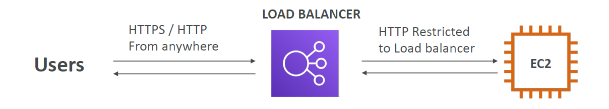

---

## 🛠️ The 4 Types of AWS Load Balancers

AWS offers four distinct load balancers engineered for specific layers of the OSI model. Always opt for modern v2 balancers over older generations.

### 1. Classic Load Balancer (CLB - v1 Old Gen)
* Operates concurrently at **Layer 4 (TCP)** and **Layer 7 (HTTP/HTTPS)**.
* Legacy tool; rarely used in new architectures.
* Provides a fixed hostname identifier.

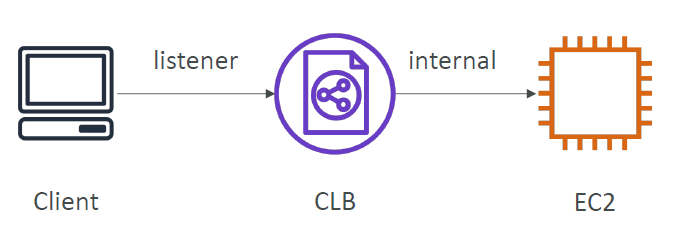

### 2. Application Load Balancer (ALB - v2 Layer 7)
* Designed exclusively for **HTTP, HTTPS, and WebSocket** traffic.
* **Smart Routing Capabilities:** Evaluates incoming request characteristics to route traffic to specific Target Groups:
    * *Path-based routing:* `example.com/users` ➡️ Target Group A | `example.com/posts` ➡️ Target Group B.
    * *Host-based routing:* `one.example.com` ➡️ Target Group A | `other.example.com` ➡️ Target Group B.
    * *Advanced routing:* Evaluation of Query Strings, Parameters, or custom HTTP Header attributes.

#### HTTP Based Traffic
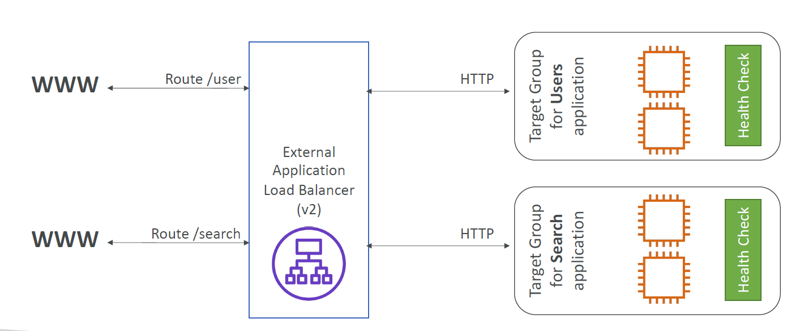

#### Query Strings/Parameters Routing
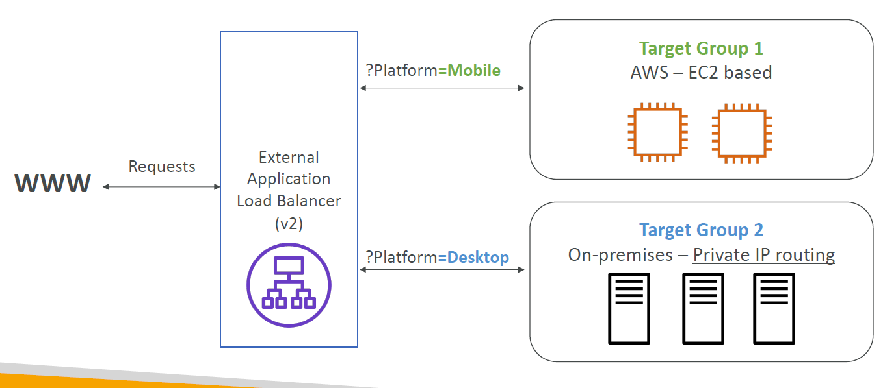

### 3. Network Load Balancer (NLB - v2 Layer 4)
* Handles ultra-low latency, high-performance **TCP, UDP, and TLS** traffic.
* Capable of processing **millions of requests per second** concurrently.
* **Static IP Mapping:** Assigns exactly **one static Public IP address per Availability Zone**. Great for network topologies that require strict IP whitelisting.

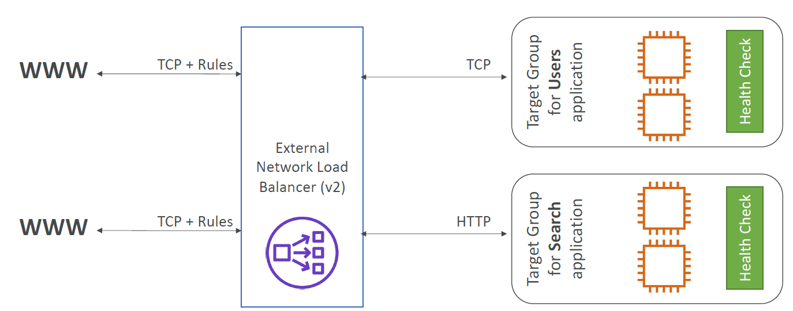

#### Target Load Balancer Setup
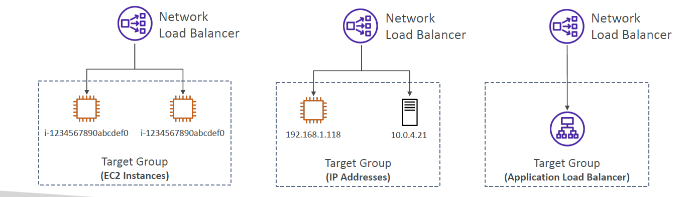

### 4. Gateway Load Balancer (GWLB - Layer 3)
* Operates at the Network Layer (**Layer 3 - IP Protocol**).
* Used to deploy, scale, and manage a central fleet of third-party virtual security network appliances (e.g., Next-Gen Firewalls, Intrusion Detection Systems (IDS/IPS), Deep Packet Inspection).
* **How it works:** Acts as a transparent gateway (a single entry/exit lane for all VPC traffic) and balances that raw packet traffic across security inspection appliances.

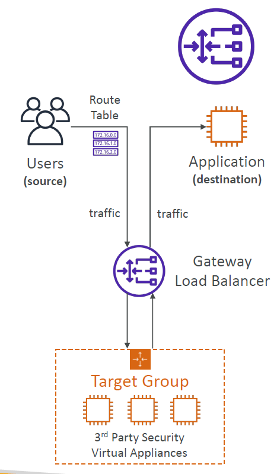
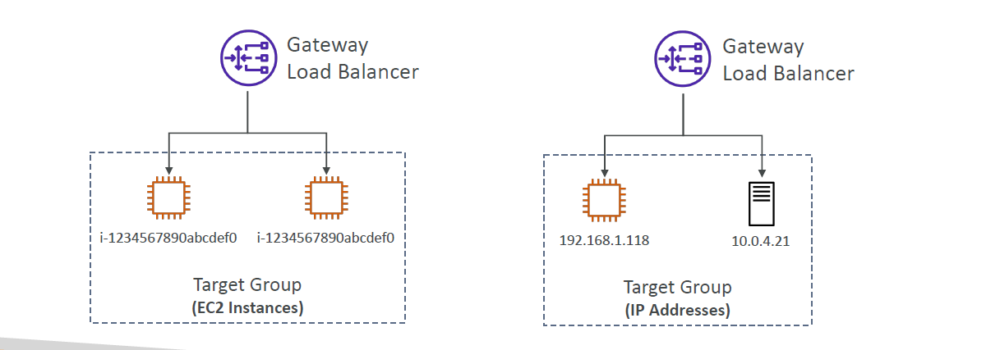

---

## 🎛️ Advanced Traffic Orchestration

### 🍪 Sticky Sessions (Session Affinity)
* Forces a specific user's requests to always route to the **exact same backend EC2 instance** to preserve local session caches.
* 🚨 **Exam Trap:** Turning on stickiness can result in an imbalanced traffic distribution across your backend cluster.

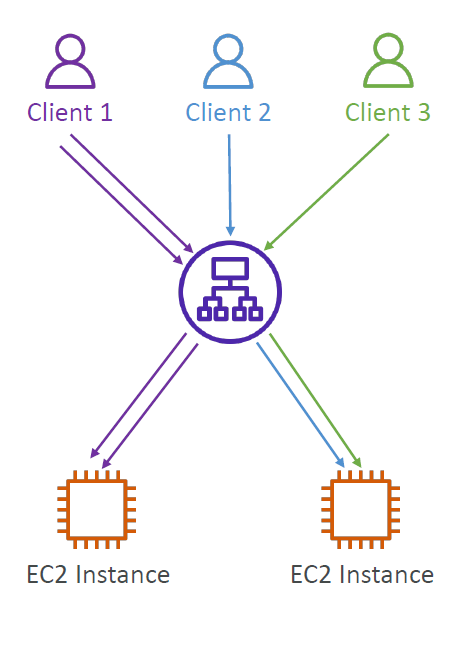

#### Sticky Cookie Classifications
* **Application-based Cookies:**
    * *Custom Cookie:* Generated directly by your application logic. Can hold any attributes. Target group configuration must specify individual cookie names. (Do not name it `AWSALB`, `AWSALBAPP`, or `AWSALBTG`—these are system reserved).
    * *Application Cookie:* Managed automatically by the ELB system. Cookie identifier is generated as `AWSALBAPP`.
* **Duration-based Cookies:** * Generated directly by the load balancer infrastructure.
    * Cookie identifier is issued as `AWSALB` (for ALBs) or `AWSELB` (for CLBs) with an explicit expiration window.

### 🌐 Cross-Zone Load Balancing
* Distributes traffic uniformly across all registered backend targets across *all* enabled AZs, rather than dividing traffic equally among the AZ nodes themselves.

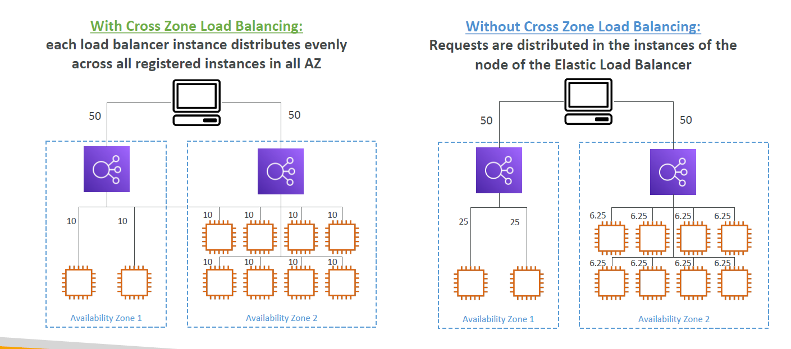

| Load Balancer Type | Default Setting | Inter-AZ Data Cost ($) |
| :--- | :--- | :--- |
| **Application Load Balancer** | Enabled by default | **Free** (No data charges between zones) |
| **Network Load Balancer** | Disabled by default | **Paid** (Incurs data charges if enabled) |
| **Gateway Load Balancer** | Disabled by default | **Paid** (Incurs data charges if enabled) |
| **Classic Load Balancer** | Disabled by default | **Free** (No data charges if manually enabled) |

### 🔒 SSL/TLS & Server Name Indication (SNI)
* **SSL/TLS Handshake:** Encryption is processed via X.509 certificates issued by standard Certificate Authorities (CAs).
* **The SNI Protocol:** Solves the problem of hosting multiple unique domains with distinct SSL certificates on a single shared load balancer listener interface.
* **Mechanics:** The client specifies the exact target hostname during the initial cryptographic handshake loop. The load balancer reviews this string to return the matching security certificate.
* 🚨 **Compatibility Trap:** SNI works perfectly with newer generation architectures (**ALB, NLB, and CloudFront**). It is **NOT** supported by the legacy Classic Load Balancer (CLB).

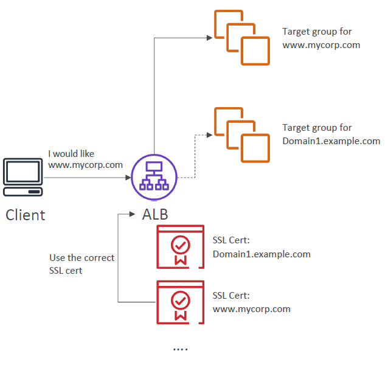

### 🛑 Connection Draining / Deregistration Delay
* **What it does:** Safely removes an instance from service when it's being terminated or marked unhealthy.
* **Mechanism:** Stops sending *new* requests to the target instance while keeping existing connections active so that active user sessions can finish processing gracefully.
* **Naming conventions:** Known as **Connection Draining** on CLB architectures, and **Deregistration Delay** on modern ALB/NLB architectures.