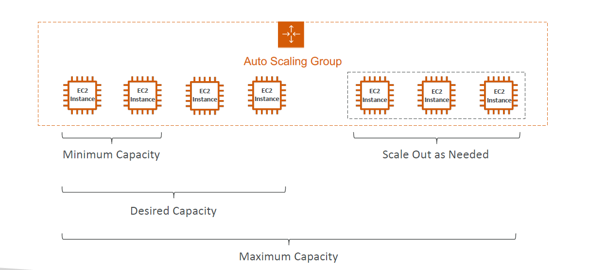
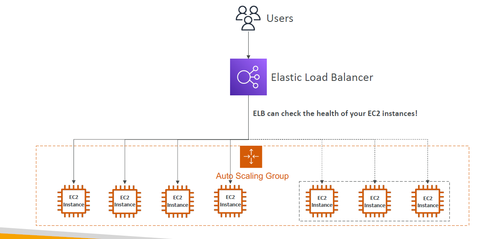
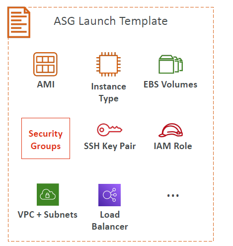
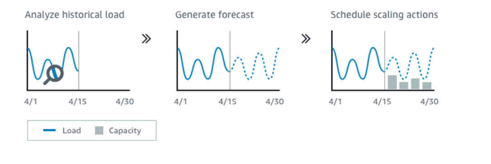

# ⚖️ AWS Auto Scaling Groups (ASG)

### 💡 TL;DR
> **Why do we use it?** An Auto Scaling Group (ASG) automatically adjusts the number of concurrent EC2 instances running your application based on real-time traffic demand. It ensures you have enough capacity during traffic spikes (Scale Out) and saves money by removing instances when traffic drops (Scale In). **ASGs themselves are free; you only pay for the underlying EC2 resources created.**

---

## 🎯 Core Goals of an ASG
1. **Scale Out:** Add EC2 instances to match increased load.
2. **Scale In:** Remove EC2 instances to save costs when load decreases.
3. **Enforce Boundaries:** Ensure the fleet size stays strictly between defined Minimum and Maximum instance counts.
4. **Load Balancer Integration:** Automatically register new instances to a Load Balancer (ALB/NLB) so they immediately receive traffic.
5. **Self-Healing:** Automatically terminate and re-create EC2 instances if they fail a health check.

---

## 🏗️ ASG Configuration Attributes

To create an ASG, you must provide a blueprint and capacity rules.

### 1. The Launch Template
*(Note: "Launch Configurations" are the older, deprecated version. Always use Launch Templates).*
The template defines exactly *what* is being booted:
* **AMI (Amazon Machine Image)** + Instance Type (e.g., `t2.micro`).
* **EC2 User Data:** Boot scripts to install software.
* **EBS Volumes:** Storage configuration.
* **Security Groups & SSH Key Pairs.**
* **IAM Roles:** Permissions for the EC2 instance.
* **Network & Subnets:** Which AZs the instances can launch into.
* **Load Balancer Information.**

### 2. Capacity Limits
* **Min Size:** The absolute lowest number of instances running (e.g., 2).
* **Initial/Desired Capacity:** The starting number of instances.
* **Max Size:** The absolute highest number of instances allowed, preventing infinite scaling costs (e.g., 10).

---

## 📈 CloudWatch Alarms & Scaling Policies

Scaling actions are triggered by **CloudWatch Alarms** monitoring metrics like Average CPU utilization, Network I/O, or custom application metrics.

### Types of Scaling Policies
* **Target Tracking Scaling:** (Easiest & Most Common). You define a target (e.g., "Keep Average CPU at 40%"). The ASG automatically scales in and out to maintain that number.
* **Simple / Step Scaling:** You define exact trigger thresholds.
    * *Example:* If CloudWatch alarm triggers CPU > 70%, add 2 instances.
    * *Example:* If CloudWatch alarm triggers CPU < 30%, remove 1 instance.
* **Scheduled Scaling:** Based on predictable, known usage patterns.
    * *Example:* Increase the Min Capacity to 10 every Friday at 5:00 PM for a weekend sale.
* **Predictive Scaling:** Uses AWS Machine Learning to continuously analyze historical load patterns and schedule scaling *ahead* of expected traffic spikes.

---

## ⏱️ Scaling Cooldowns

* **What is it?** After a scaling activity (like adding an instance) occurs, the ASG enters a "Cooldown Period" where it pauses and refuses to add or remove any more instances.
* **Default Time:** 300 seconds (5 minutes).
* **Why?** It gives the newly launched instances time to boot up, install software, and start handling traffic so CloudWatch metrics can stabilize. Without a cooldown, the ASG might panic during boot times and launch way too many instances.
* **Pro-Tip for Exams:** To reduce cooldown times and scale faster, use a **custom AMI** (Golden Image) that already has all software pre-installed, rather than relying on slow EC2 User Data boot scripts.