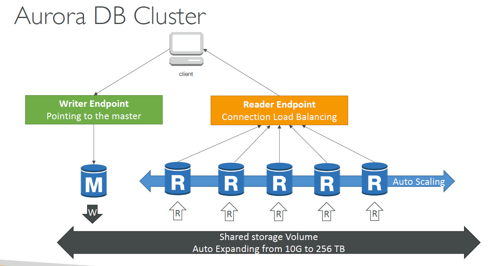
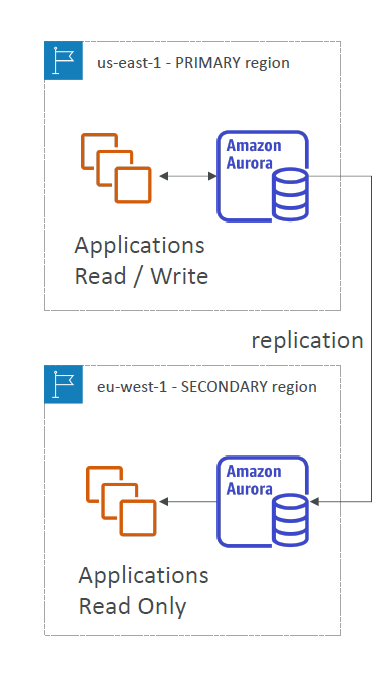
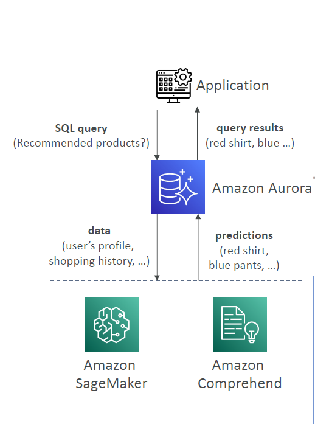

# Amazon Aurora

- Aurora is a proprietary technology from AWS (not open sourced)
- Postgres and MySQL are both supported as Aurora DB
- Aurora is “AWS cloud optimized” and claims 5x performance improvement over MySQL on RDS, over 3x the performance of Postgres on RDS
- Failover in Aurora is instantaneous. It’s HA (High Availability) native.
- Aurora costs more than RDS (20% more) – but is more efficient

## Aurora High Availability and Read Scaling
- 6 copies of your data across 3 AZ:
  - 4 copies out of 6 needed for writes
  - 3 copies out of 6 need for reads
  - Self healing with peer-to-peer replication
  - Storage is striped across 100s of volumes
- One Aurora Instance takes writes (master)
- Automated failover for master in less than 30 seconds
- Master + up to 15 Aurora Read Replicas serve reads
- Support for Cross Region Replication
- 

---
## Aurora DB Cluster

---

## Aurora – Custom Endpoints

-----
## Aurora Serverless

## Global Aurora 

- Aurora Cross Region Read Replicas
  - Useful for disaster recovery
  - Simple to put in place
- Aurora Global Database (recommended):
  - 1 Primary Region (read / write)
  - Up to 10 secondary (read-only) regions, replication lag is less than 1 second
  - Up to 16 Read Replicas per secondary region
  - Helps for decreasing latency
  - Promoting another region (for disaster recovery) has an RTO of < 1 minute
  - Typical cross-region replication takes less than 1 second

--- 
## Aurora Machine Learning

---

# Backup 
## RDS Backup
- Automated backup based on time , days, 
  - 1 to 35 days of retention, set 0 to disable automated backups
- manual DB snapshot
  
## Aurora Backups
- Automated backups - 1 to 35 days (cannot be disabled)
- Manual DB Snapshots

# Restore option
- Restoring a RDS / Aurora backup or a snapshot creates a new database
- Restoring MySQL RDS database from S3
  - Create a backup of your on-premises database
  - Store it on Amazon S3 (object storage)
  - Restore the backup file onto a new RDS instance running MySQL
- Restoring MySQL Aurora cluster from S3
  - Create a backup of your on-premises database using Percona XtraBackup
  - Store the backup file on Amazon S3
  - Restore the backup file onto a new Aurora cluster running MySQL

# Aurora Database Cloning
- Create a new Aurora DB Cluster from an existing one
- Faster than snapshot & restore

# RDS & Aurora Security
- At-rest encryption:
  - Database master & replicas encryption using AWS KMS – must be defined as launch time
  - If the master is not encrypted, the read replicas cannot be encrypted
  - To encrypt an un-encrypted database, go through a DB snapshot & restore as encrypted
- In-flight encryption: TLS-ready by default, use the AWS TLS root certificates client-side
- IAM Authentication: IAM roles to connect to your database (instead o- username/pw)
- Security Groups: Control Network access to your RDS / Aurora DB
- No SSH available except on RDS Custom
- Audit Logs can be enabled and sent to CloudWatch Logs for longer retention